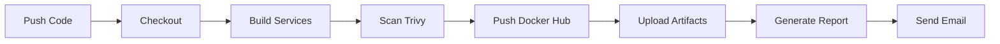

# 🛒 Secure E-Commerce Microservices Platform


---

## 📋 Vue d'ensemble

Plateforme e-commerce **cloud-native** basée sur une **architecture microservices**, conçue pour démontrer des compétences solides en **DevSecOps**, **CI/CD** et **orchestration de conteneurs**.

Ce projet simule un environnement **production-ready** avec des services découplés, scalables et construits via des pipelines automatisés et sécurisés.

---

## 🎯 Objectifs du projet

- ✅ **Architecture microservices** découplée et scalable
- ✅ **Pipeline CI/CD** automatisé avec GitHub Actions
- ✅ **Sécurité intégrée** avec scan de vulnérabilités (Trivy)
- ✅ **Infrastructure as Code** avec Docker Compose
- ✅ **Service Discovery** et configuration centralisée
- ✅ **Monitoring** et health checks automatisés

---

## 🏗 Architecture & Stack technologique

### 📐 Architecture globale

```
┌─────────────────────────────────────────────────────────┐
│                     API GATEWAY                          │
│              (Spring Cloud Gateway)                      │
└──────────────────┬──────────────────────────────────────┘
                   │
        ┌──────────┼──────────┬──────────────┐
        │          │          │              │
    ┌───▼───┐  ┌──▼────┐  ┌──▼──────┐  ┌───▼──────┐
    │ USER  │  │PRODUCT│  │  ORDER  │  │ CONFIG   │
    │SERVICE│  │SERVICE│  │ SERVICE │  │ SERVER   │
    └───┬───┘  └──┬────┘  └──┬──────┘  └──────────┘
        │         │          │
    ┌───▼───┐  ┌──▼────┐  ┌──▼──────┐
    │MySQL  │  │MySQL  │  │  MySQL  │
    │User DB│  │Prod DB│  │Order DB │
    └───────┘  └───────┘  └─────────┘
         │
    ┌────▼─────────┐
    │    CONSUL    │ ← Service Discovery & Health Checks
    └──────────────┘
         │
    ┌────▼─────────┐
    │    REDIS     │ ← Caching Layer
    └──────────────┘
```

### 🛠 Composants infrastructure

| Composant | Technologie | Rôle |
|-----------|------------|------|
| **Service Discovery** | HashiCorp Consul | Enregistrement dynamique des services & health checks |
| **API Gateway** | Spring Cloud Gateway | Point d'entrée unique, routage & load balancing |
| **Config Server** | Spring Cloud Config | Configuration centralisée (Git-backed) |
| **Cache** | Redis | Couche de cache distribuée |
| **Bases de données** | MySQL 8.0 | Pattern database-per-service |

### 🔧 Microservices

| Service | Description | Port | Base de données |
|---------|-------------|------|-----------------|
| **User Service** | Gestion utilisateurs & authentification JWT | 8081 | MySQL (user_db) |
| **Product Service** | Catalogue produits & gestion inventaire | 8082 | MySQL (product_db) |
| **Order Service** | Cycle de vie des commandes | 8083 | MySQL (order_db) |

Chaque service est **indépendant**, avec son propre cycle de build, scan et déploiement.

---

## 🚀 Pipeline DevSecOps CI/CD

### 📊 Workflow GitHub Actions

Le pipeline est défini dans `.github/workflows/CI-pipeline.yml`

#### 🎯 Fonctionnalités clés

##### 1. **Build parallélisés** (Matrix Strategy)
- Construction simultanée de tous les services
- Réduction significative du temps d'exécution (~60%)
- Services concernés :
  - `config-server`
  - `api-gateway`
  - `user-service`
  - `product-service`
  - `order-service`

##### 2. **Sécurité automatisée** (Trivy)
- Scan des images Docker pour vulnérabilités **CRITICAL** et **HIGH**
- Deux formats de sortie :
  - **SARIF** → intégré à l'onglet Security de GitHub
  - **Texte** → rapports lisibles par humains

##### 3. **Gestion des artefacts**
- Upload automatique des résultats de scan
- Agrégation dans un rapport global : `global_security_report.txt`

##### 4. **Notifications automatiques**
- Envoi d'un rapport consolidé par **email SMTP**
- Feedback rapide après chaque exécution

### 📈 Étapes du pipeline



---

## 🛠 Installation & Déploiement local

### 📋 Prérequis

- **Docker** (v20.10+)
- **Docker Compose** (v2.0+)
- **Java 17+** (pour développement local)
- **Git**

### 🔧 Installation en 4 étapes

#### 1️⃣ Cloner le repository

```bash
git clone https://github.com/rajumb0232/E-Commerce-Microservice.git
cd E-Commerce-Microservice
```

#### 2️⃣ Configurer les variables d'environnement

Créer un fichier `.env` à la racine du projet :

```env
# Credentials Git (pour Config Server)
GIT_USER=your_git_username
GIT_PASS=your_git_token

# Base de données
MYSQL_ROOT_PASSWORD=root
```

⚠️ **Important** : Ne jamais commit le fichier `.env`

#### 3️⃣ Lancer la stack complète

```bash
docker-compose up -d --build
```

Cette commande va :
- Construire toutes les images Docker
- Démarrer tous les services avec leurs dépendances
- Créer le réseau isolé `ecom-network`

#### 4️⃣ Vérifier le déploiement

Attendre environ 2-3 minutes que tous les services soient prêts.

```bash
# Vérifier les logs
docker-compose logs -f

# Vérifier l'état des services
docker-compose ps
```

### 🌐 Accès aux services

| Service | URL | Description |
|---------|-----|-------------|
| **Consul UI** | http://localhost:8500 | Dashboard de service registry |
| **API Gateway** | http://localhost:8080 | Point d'entrée de l'application |
| **Config Server** | http://localhost:1000 | Serveur de configuration |
| **User Service** | http://localhost:8081 | API de gestion utilisateurs |
| **Product Service** | http://localhost:8082 | API catalogue produits |
| **Order Service** | http://localhost:8083 | API gestion commandes |
| **MySQL User DB** | `localhost:3306` | Base de données User Service |

---

## ⚙️ Configuration GitHub Actions

### 🔐 Secrets à configurer

Aller dans **Settings → Secrets and variables → Actions** et ajouter :

| Secret | Description | Exemple |
|--------|-------------|---------|
| `DOCKER_USERNAME` | Nom d'utilisateur Docker Hub | `votreusername` |
| `DOCKER_PASSWORD` | Token d'accès Docker Hub | `dckr_pat_xxxxx` |
| `MAIL_USERNAME` | Email expéditeur SMTP | `devops@votredomaine.com` |
| `MAIL_PASSWORD` | Mot de passe application SMTP | `xxxx xxxx xxxx xxxx` |

### 📧 Configuration SMTP (Gmail)

1. Activer la validation en 2 étapes sur votre compte Google
2. Générer un mot de passe d'application :
   - Compte Google → Sécurité → Validation en 2 étapes
   - Mots de passe des applications → Sélectionner "Autre"
3. Utiliser ce mot de passe pour `MAIL_PASSWORD`

---

## 🛡 Bonnes pratiques de sécurité

### ✅ Implémentées

- ✔️ Scan continu des vulnérabilités des conteneurs
- ✔️ Isolation réseau Docker (`ecom-network`)
- ✔️ Health checks pour vérifier la disponibilité des dépendances
- ✔️ Secrets injectés via variables d'environnement
- ✔️ Aucun credential en dur dans le code
- ✔️ Pattern database-per-service pour isolation des données
- ✔️ JWT pour authentification sécurisée

### 🔒 Recommandations production

- Utiliser un gestionnaire de secrets (HashiCorp Vault, AWS Secrets Manager)
- Implémenter rate limiting sur l'API Gateway
- Configurer TLS/SSL pour toutes les communications
- Mettre en place des audits de sécurité réguliers
- Activer la rotation automatique des secrets

---

## 📜 Scripts utilitaires

Un script helper est disponible pour les opérations Docker manuelles :

```bash
# Rendre le script exécutable
chmod +x build-and-push.sh

# Exécuter le script
./build-and-push.sh
```

### 🧹 Commandes utiles

```bash
# Arrêter tous les services
docker-compose down

# Arrêter et supprimer les volumes
docker-compose down -v

# Voir les logs d'un service spécifique
docker-compose logs -f user-service

# Reconstruire un service spécifique
docker-compose up -d --build user-service

# Nettoyer les images non utilisées
docker system prune -a
```

---

## 📈 Roadmap & Améliorations futures

### 🎯 Court terme

- [ ] Migration vers **Kubernetes** (EKS / Minikube)
- [ ] **Helm charts** pour la gestion des releases
- [ ] Intégration **Prometheus + Grafana** pour l'observabilité
- [ ] Tests d'intégration automatisés

### 🚀 Moyen terme

- [ ] Gestion externe des secrets (Vault / AWS Secrets Manager)
- [ ] Intégration **DAST** (OWASP ZAP)
- [ ] **Service Mesh** (Istio / Linkerd)
- [ ] **GitOps** avec ArgoCD

### 🌟 Long terme

- [ ] Multi-cloud deployment
- [ ] Auto-scaling basé sur métriques
- [ ] Disaster recovery & backup automatisé
- [ ] API versioning & backward compatibility

---

## 🤝 Contribution

Les contributions sont les bienvenues ! Pour contribuer :

1. Fork le projet
2. Créer une branche (`git checkout -b feature/amazing-feature`)
3. Commit vos changements (`git commit -m 'Add amazing feature'`)
4. Push vers la branche (`git push origin feature/amazing-feature`)
5. Ouvrir une Pull Request

---

## 📄 Licence

Ce projet est sous licence MIT. Voir le fichier `LICENSE` pour plus de détails.

---

## 👤 Auteur

**Otniel TAMINI**  
*DevOps Engineer*

[](https://linkedin.com/in/otniel-tamini)
[](https://github.com/otniel-tamini)
[](mailto:otnieltamini@gmail.com)

---

## 🙏 Remerciements

- Spring Boot & Spring Cloud teams
- HashiCorp pour Consul
- Aqua Security pour Trivy
- La communauté DevOps

---

<div align="center">

**⭐ Si ce projet vous a été utile, n'hésitez pas à lui donner une étoile !**

Made with ❤️ by Otniel TAMINI

</div>